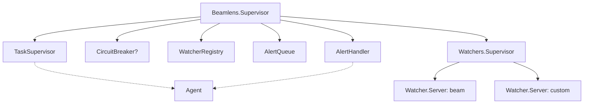
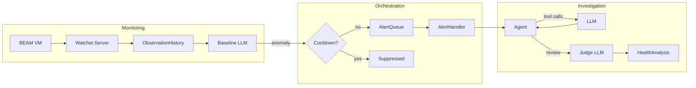
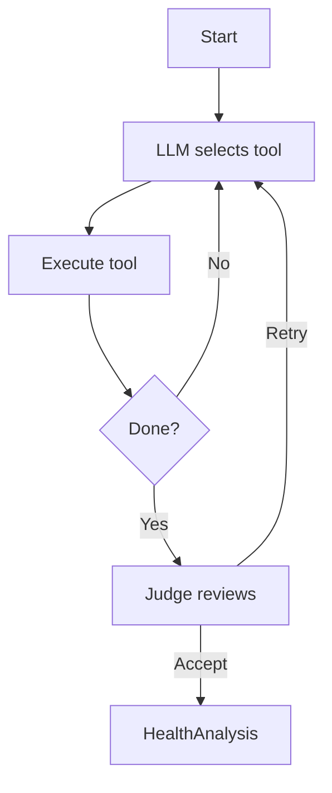

# Architecture

BeamLens uses an **orchestrator-workers** architecture where specialized watchers autonomously monitor BEAM VM metrics, learn baseline behavior using LLMs, and detect anomalies. When issues are found, an AI agent investigates and correlates findings.

## Supervision Tree

Add BeamLens to your application's supervision tree:

```elixir
{Beamlens, watchers: [{:beam, "*/5 * * * *"}]}
```

This starts the following components:



Each watcher runs independently. If one crashes, others continue operating. CircuitBreaker is optional.

## Data Flow

Data flows through three stages: monitoring, orchestration, and investigation.



1. **Monitoring**: Watcher servers collect VM metrics on cron schedules, storing observations in a sliding window. The baseline LLM learns normal patterns and detects deviations.
2. **Orchestration**: When anomalies are detected, they pass through a cooldown check to prevent duplicate alerts, then flow through a queue to the handler.
3. **Investigation**: The agent runs a tool-calling loop to gather detailed metrics, then a judge reviews the analysis.

## Alert Cooldown

To prevent alert fatigue, detected anomalies are subject to a per-category cooldown. The baseline LLM specifies the cooldown duration based on context (defaulting to 5 minutes). After reporting an anomaly, subsequent anomalies of the same category within the cooldown period are suppressed. Categories are derived from the anomaly type prefix (e.g., "memory_high" → memory).

## Agent Loop

The agent uses an LLM to select which metrics to gather, executing tools until it has enough information to produce an analysis.



Available tools include GetOverview, GetSystemInfo, GetMemoryStats, GetProcessStats, GetSchedulerStats, GetAtomStats, GetPersistentTerms, and GetTopProcesses.

## Components

| Component | Purpose |
|-----------|---------|
| Watcher.Server | GenServer running individual watcher on cron schedule |
| ObservationHistory | Sliding window buffer for baseline observations |
| Baseline.Analyzer | Calls AnalyzeBaseline LLM to learn patterns and detect anomalies |
| Baseline.Context | Tracks LLM notes and timing for baseline learning |
| Baseline.Investigator | Tool-calling loop for watcher anomaly investigation |
| Baseline.Decision | Decision structs (ContinueObserving, Alert, Healthy) for baseline LLM output |
| AlertQueue | Buffer anomaly alerts from watchers |
| AlertHandler | Trigger investigation when alerts arrive |
| Agent | Run tool-calling loop to gather metrics |
| Judge | Review analysis quality, request retries if needed |
| CircuitBreaker | Protect against LLM rate limits (optional) |
| WatcherRegistry | Registry for looking up watcher processes by name |

## Included Watchers

### BEAM Watcher (`:beam`)

Monitors BEAM VM runtime health using LLM-driven baseline learning.

**Baseline Metrics** (tracked for pattern learning):
- Memory utilization %
- Process utilization %
- Port utilization %
- Atom utilization %
- Scheduler run queue depth
- Schedulers online

**Investigation Tools** (available when anomaly detected):

| Tool | Description |
|------|-------------|
| `get_overview` | Utilization percentages across all categories |
| `get_system_info` | Node identity, OTP version, uptime, schedulers |
| `get_memory_stats` | Memory breakdown: total, processes, system, binary, ETS, code |
| `get_process_stats` | Process/port counts and limits |
| `get_scheduler_stats` | Scheduler counts and run queue |
| `get_atom_stats` | Atom table count, limit, memory |
| `get_persistent_terms` | Persistent term count and memory |
| `get_top_processes` | Top processes by memory, message queue, or reductions |

**Configuration:**
```elixir
{:beam, "*/5 * * * *"}  # Run every 5 minutes
```

## LLM Integration

BeamLens uses [BAML](https://docs.boundaryml.com) for type-safe LLM prompts via the [Puck](https://github.com/bradleygolden/puck) framework. Four BAML functions handle different stages:

- **AnalyzeBaseline**: Observes metrics over time, decides whether to continue watching, alert on anomaly, or report healthy
- **SelectInvestigationTool**: Watcher investigation loop, gathers detailed data after anomaly detection
- **SelectTool**: Main agent loop, chooses which metric-gathering tool to execute next
- **JudgeAnalysis**: Reviews the agent's analysis for quality, may request retries

## LLM Client Configuration

By default, BeamLens uses Anthropic's Claude Haiku. Configure alternative LLM providers via `:client_registry`:

```elixir
{Beamlens,
  watchers: [{:beam, "*/5 * * * *"}],
  client_registry: %{
    primary: "Ollama",
    clients: [
      %{name: "Ollama", provider: "openai-generic",
        options: %{base_url: "http://localhost:11434/v1", model: "llama3"}}
    ]
  }
}
```

The `client_registry` propagates through the supervision tree to all LLM-calling components:
- `Beamlens.Agent` for health analysis
- `Beamlens.Judge` for quality checks
- `Beamlens.AlertHandler` for alert investigation
- `Beamlens.Watchers.Baseline.Analyzer` for anomaly detection
- `Beamlens.Watchers.Baseline.Investigator` for deep investigation
