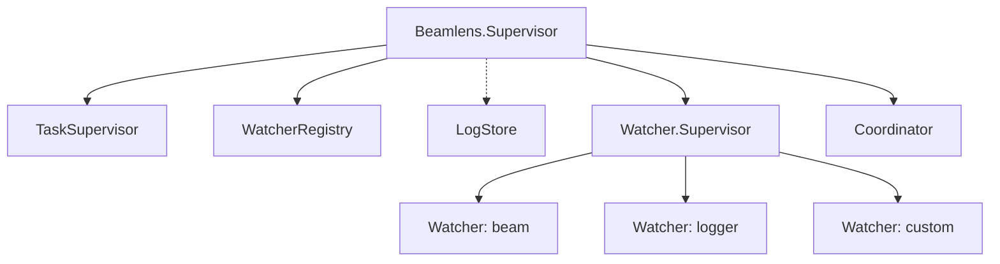
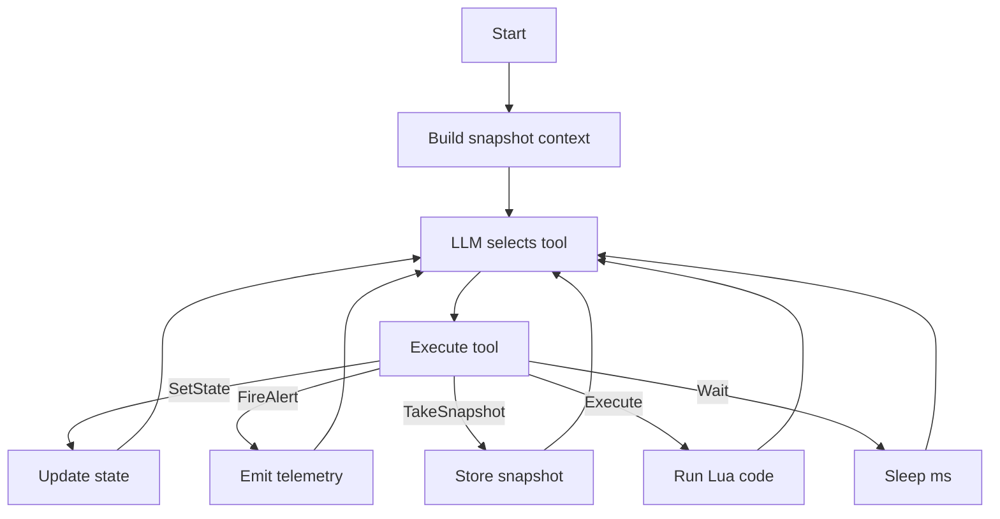

# Architecture

BeamLens uses an **autonomous watcher** architecture where specialized watchers run continuous LLM-driven loops to monitor domains and detect anomalies. Alerts are emitted via telemetry.

## Supervision Tree

Add BeamLens to your application's supervision tree:

```elixir
{Beamlens, watchers: [:beam]}
```

This starts the following components:



Each watcher runs independently. If one crashes, others continue operating. The Coordinator receives alerts from all watchers and correlates them into insights.

> **Note:** LogStore (shown with dashed line) is only started when the `:logger` watcher is configured. It captures application logs via an Erlang `:logger` handler.

## Watcher Loop

Each watcher is a GenServer running a continuous LLM-driven loop:



The LLM controls the loop timing via the `wait` tool. There are no fixed schedules.

## State Model

Watchers maintain one of four states reflecting current assessment:

| State | Description |
|-------|-------------|
| `healthy` | Everything is normal |
| `observing` | Something looks off, gathering more data |
| `warning` | Elevated concern, not yet critical |
| `critical` | Active issue requiring attention |

State transitions are driven by the LLM via the `set_state` tool.

## Coordinator

The Coordinator is a GenServer that receives alerts from all watchers and correlates them into unified insights. When watchers fire alerts via telemetry, the Coordinator queues them and runs an LLM-driven analysis loop.

### Alert States

| State | Description |
|-------|-------------|
| `unread` | New alert, not yet processed |
| `acknowledged` | Currently being analyzed |
| `resolved` | Processed (correlated into insight or dismissed) |

### Coordinator Tools

| Tool | Description |
|------|-------------|
| `get_alerts` | Query alerts, optionally filtered by status |
| `update_alert_statuses` | Set status on multiple alerts |
| `produce_insight` | Create insight correlating alerts (auto-resolves them) |
| `done` | End processing, wait for next alert |
| `think` | Reason through complex decisions before acting |

### Correlation Types

When producing insights, the Coordinator classifies how alerts are related:

| Type | Description |
|------|-------------|
| `temporal` | Alerts occurred close in time, possibly related |
| `causal` | One alert directly caused another (A → B) |
| `symptomatic` | Alerts share a common hidden cause (A ← X → B) |

### Subscribe to Insights

```elixir
:telemetry.attach("my-insights", [:beamlens, :coordinator, :insight_produced], fn
  _event, _measurements, %{insight: insight}, _config ->
    Logger.info("Insight: #{insight.summary}")
end, nil)
```

## Available Tools

| Tool | Description |
|------|-------------|
| `set_state` | Update watcher state with reason |
| `fire_alert` | Create alert with referenced snapshots |
| `get_alerts` | Retrieve previous alerts for correlation |
| `take_snapshot` | Capture current metrics with unique ID |
| `get_snapshot` | Retrieve specific snapshot by ID |
| `get_snapshots` | Retrieve multiple snapshots with pagination |
| `execute` | Run Lua code with metric callbacks |
| `wait` | Sleep before next iteration (LLM-controlled timing) |
| `think` | Reason through complex decisions before acting |

## Lua Callbacks

The `execute` tool runs Lua code in a sandbox with access to domain-specific callbacks. Each domain provides its own prefixed callbacks (e.g., `beam_get_memory` for the BEAM domain).

Example Lua code for the BEAM domain:

```lua
local mem = beam_get_memory()
local procs = beam_top_processes(5, "memory")
return {memory = mem, top_procs = procs}
```

See the domain sections below for available callbacks per domain.

## Telemetry Events

Watchers and the Coordinator emit telemetry events for observability. Key events:

| Event | Description |
|-------|-------------|
| `[:beamlens, :watcher, :started]` | Watcher initialized |
| `[:beamlens, :watcher, :state_change]` | State transitioned |
| `[:beamlens, :watcher, :alert_fired]` | Alert created |
| `[:beamlens, :watcher, :iteration_start]` | Loop iteration began |
| `[:beamlens, :coordinator, :started]` | Coordinator initialized |
| `[:beamlens, :coordinator, :alert_received]` | Alert queued for correlation |
| `[:beamlens, :coordinator, :iteration_start]` | Analysis loop iteration began |
| `[:beamlens, :coordinator, :insight_produced]` | Insight created from correlated alerts |
| `[:beamlens, :coordinator, :done]` | Analysis loop completed |
| `[:beamlens, :llm, :start]` | LLM call started |
| `[:beamlens, :llm, :stop]` | LLM call completed |

Subscribe to alerts:

```elixir
:telemetry.attach("my-alerts", [:beamlens, :watcher, :alert_fired], fn
  _event, _measurements, %{alert: alert}, _config ->
    Logger.warning("Alert: #{alert.summary}")
end, nil)
```

See `Beamlens.Telemetry` for the complete event list.

## LLM Integration

BeamLens uses [BAML](https://docs.boundaryml.com) for type-safe LLM prompts via [Puck](https://github.com/bradleygolden/puck). Two BAML functions handle the agent loops:

- **WatcherLoop**: Continuous agent loop that observes metrics and selects tools
- **CoordinatorLoop**: Alert correlation agent that identifies patterns across watchers

Default LLM: Anthropic Claude Haiku (`claude-haiku-4-5-20251001`)

## LLM Client Configuration

Configure alternative LLM providers via `:client_registry`:

```elixir
{Beamlens,
  watchers: [:beam],
  client_registry: %{
    primary: "Ollama",
    clients: [
      %{name: "Ollama", provider: "openai-generic",
        options: %{base_url: "http://localhost:11434/v1", model: "llama3"}}
    ]
  }
}
```

See [providers.md](providers.md) for configuration examples.

## Built-in Domains

| Domain | Module | Description |
|--------|--------|-------------|
| `:beam` | `Beamlens.Domain.Beam` | BEAM VM metrics (memory, processes, schedulers, atoms) |
| `:ets` | `Beamlens.Domain.Ets` | ETS table monitoring |
| `:gc` | `Beamlens.Domain.Gc` | Garbage collection statistics |
| `:logger` | `Beamlens.Domain.Logger` | Application log monitoring |
| `:ports` | `Beamlens.Domain.Ports` | Port monitoring (file descriptors, sockets) |
| `:sup` | `Beamlens.Domain.Sup` | Supervisor tree monitoring |
| `:system` | `Beamlens.Domain.System` | OS-level metrics (CPU, memory, disk via os_mon) |
| `:ecto` | `Beamlens.Domain.Ecto` | Database monitoring (requires custom domain module) |

### BEAM Domain (`:beam`)

Monitors BEAM VM runtime health.

**Snapshot Metrics:**
- Memory utilization %
- Process utilization %
- Port utilization %
- Atom utilization %
- Scheduler run queue depth
- Schedulers online

**Lua Callbacks:**

| Callback | Description |
|----------|-------------|
| `beam_get_memory()` | Memory breakdown by category |
| `beam_get_processes()` | Process/port counts and limits |
| `beam_get_schedulers()` | Scheduler stats and run queue |
| `beam_get_atoms()` | Atom table statistics |
| `beam_get_system()` | Node info, OTP version, uptime |
| `beam_get_persistent_terms()` | Persistent term count and memory |
| `beam_top_processes(limit, sort_by)` | Top processes by memory/queue/reductions |

### ETS Domain (`:ets`)

Monitors ETS table health and memory usage.

**Snapshot Metrics:**
- Table count
- Total memory (MB)
- Largest table memory (MB)

**Lua Callbacks:**

| Callback | Description |
|----------|-------------|
| `ets_list_tables()` | All tables: name, type, protection, size, memory |
| `ets_table_info(table_name)` | Single table details |
| `ets_top_tables(limit, sort_by)` | Top N tables by "memory" or "size" |

### GC Domain (`:gc`)

Monitors garbage collection activity.

**Snapshot Metrics:**
- Total GCs
- Words reclaimed
- Bytes reclaimed (MB)

**Lua Callbacks:**

| Callback | Description |
|----------|-------------|
| `gc_stats()` | Global GC statistics |
| `gc_top_processes(limit)` | Processes with largest heaps |

### Logger Domain (`:logger`)

Monitors application logs via Erlang's `:logger` handler system.

> **Important:** The Logger domain captures application log messages and makes them available for LLM analysis. Ensure your application logs do not contain sensitive data (PII, secrets, tokens) before enabling this watcher. Review your logging configuration to verify log messages are safe for analysis.

**Snapshot Metrics:**
- Total log count (1 minute window)
- Error count (1 minute window)
- Warning count (1 minute window)
- Error rate %
- Unique error modules

**Lua Callbacks:**

| Callback | Description |
|----------|-------------|
| `logger_stats()` | Log statistics: counts by level, error rate |
| `logger_recent(limit, level)` | Recent logs, optionally filtered by level |
| `logger_errors(limit)` | Recent error-level logs |
| `logger_search(pattern, limit)` | Search logs by regex pattern |
| `logger_by_module(module_name, limit)` | Logs from modules matching name |

### Ports Domain (`:ports`)

Monitors BEAM ports (file descriptors, sockets).

**Snapshot Metrics:**
- Port count
- Port limit
- Port utilization %

**Lua Callbacks:**

| Callback | Description |
|----------|-------------|
| `ports_list()` | All ports: id, name, connected_pid |
| `ports_info(port_id)` | Port details: I/O bytes, memory |
| `ports_top(limit, sort_by)` | Top N ports by "input", "output", or "memory" |

### Sup Domain (`:sup`)

Monitors supervisor tree structure.

**Snapshot Metrics:**
- Supervisor count
- Total children

**Lua Callbacks:**

| Callback | Description |
|----------|-------------|
| `sup_list()` | All supervisors: name, pid, child_count, active_children |
| `sup_children(supervisor_name)` | Direct children: id, pid, type |
| `sup_tree(supervisor_name)` | Full supervision tree (recursive, depth-limited) |

### System Domain (`:system`)

Monitors OS-level system health via Erlang's os_mon application.

> **Requirement:** Add `:os_mon` to your application's `extra_applications`.
> **Platform Notes:** `cpu_sup` metrics are only available on Unix.

**Snapshot Metrics:**
- CPU load (1m, 5m, 15m averages)
- Memory used %
- Disk max used %

**Lua Callbacks:**

| Callback | Description |
|----------|-------------|
| `system_get_cpu()` | CPU load averages and process count |
| `system_get_memory()` | System memory stats |
| `system_get_disks()` | Disk usage per mount point |

### Ecto Domain (`:ecto`)

Monitors Ecto database health. Requires a custom domain module and supporting infrastructure.

**Step 1:** Create a domain module:

```elixir
defmodule MyApp.EctoDomain do
  use Beamlens.Domain.Ecto, repo: MyApp.Repo
end
```

**Step 2:** Add the required components to your supervision tree:

```elixir
children = [
  # Ecto domain infrastructure (must start before Beamlens)
  {Registry, keys: :unique, name: Beamlens.Domain.Ecto.Registry},
  {Beamlens.Domain.Ecto.TelemetryStore, repo: MyApp.Repo},

  # Beamlens with Ecto watcher
  {Beamlens, watchers: [
    [name: :ecto, domain_module: MyApp.EctoDomain]
  ]}
]
```

**Snapshot Metrics:**
- Query count (1 minute window)
- Average query time (ms)
- Max query time (ms)
- P95 query time (ms)
- Slow query count
- Error count

**Lua Callbacks:**

| Callback | Description |
|----------|-------------|
| `ecto_query_stats()` | Query statistics from telemetry |
| `ecto_slow_queries(limit)` | Recent slow queries from telemetry |
| `ecto_pool_stats()` | Connection pool health |
| `ecto_db_slow_queries(limit)` | Slow queries from pg_stat_statements (PostgreSQL) |
| `ecto_index_usage()` | Index scan statistics (PostgreSQL) |
| `ecto_unused_indexes()` | Indexes with zero scans (PostgreSQL) |
| `ecto_table_sizes(limit)` | Table sizes (PostgreSQL) |
| `ecto_cache_hit()` | Buffer cache hit ratios (PostgreSQL) |
| `ecto_locks()` | Active database locks (PostgreSQL) |
| `ecto_long_running()` | Long-running queries (PostgreSQL) |
| `ecto_bloat(limit)` | Table/index bloat (PostgreSQL) |
| `ecto_connections()` | Database connections (PostgreSQL) |

PostgreSQL-specific callbacks require `{:ecto_psql_extras, "~> 0.8"}` as an optional dependency.

## Custom Domains

Implement the `Beamlens.Domain` behaviour to create custom monitoring domains:

```elixir
defmodule MyApp.Domain.Postgres do
  @behaviour Beamlens.Domain

  @impl true
  def domain, do: :postgres

  @impl true
  def snapshot do
    %{
      active_connections: count_active(),
      pool_size: pool_size(),
      query_queue_depth: queue_depth()
    }
  end

  @impl true
  def callbacks do
    %{
      "postgres_slow_queries" => &slow_queries/0,
      "postgres_pool_stats" => &pool_stats/0
    }
  end

  @impl true
  def callback_docs do
    """
    ### postgres_slow_queries()
    Returns queries exceeding threshold: query, duration_ms, calls

    ### postgres_pool_stats()
    Connection pool stats: size, available, checked_out, waiting
    """
  end
end
```

Register in supervision tree:

```elixir
{Beamlens, watchers: [
  :beam,
  [name: :postgres, domain_module: MyApp.Domain.Postgres]
]}
```
