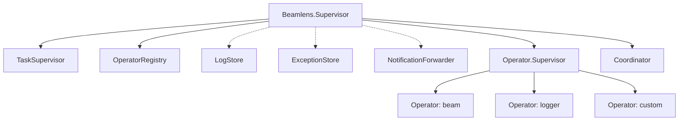
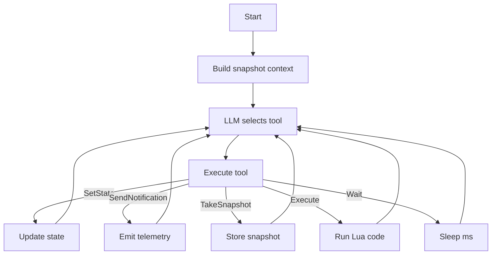

# Architecture

beamlens uses an **autonomous operator** architecture where specialized operators run LLM-driven loops to monitor skills and detect anomalies. Operators support two modes: **continuous** for always-on monitoring and **on-demand** for triggered analysis. Notifications are emitted via telemetry.

## Supervision Tree

Add beamlens to your application's supervision tree:

```elixir
{Beamlens, operators: [:beam]}
```

This starts the following components:



Each operator runs independently. If one crashes, others continue operating. The Coordinator receives notifications from all operators and correlates them into insights.

> **Note:** LogStore, ExceptionStore, and NotificationForwarder (shown with dashed lines) are conditionally started. LogStore and ExceptionStore require their respective operators (`:logger`, `:exception`). NotificationForwarder is started when `:pubsub` is configured for clustered deployments.

## Operator Loop

Each operator is a GenServer running a continuous LLM-driven loop:



The LLM controls the loop timing via the `wait` tool. There are no fixed schedules.

## Operator Modes

Operators support two execution modes:

### Continuous Mode

For always-on monitoring that runs indefinitely:

```elixir
{Beamlens, operators: [:beam]}
```

The LLM controls timing via `wait()`. This is the default for supervised operators. Uses the `OperatorLoop` BAML function.

### On-Demand Mode

For scheduled or triggered analysis (e.g., Oban workers):

```elixir
{:ok, notifications} = Beamlens.Operator.run(:beam, client_registry(),
  context: %{reason: "high memory detected"}
)
```

The LLM investigates and calls `done()` when finished, returning notifications generated during analysis. Uses the `OperatorRun` BAML function which includes the `done` tool.

## State Model

Operators maintain one of four states reflecting current assessment:

| State | Description |
|-------|-------------|
| `healthy` | Everything is normal |
| `observing` | Something looks off, gathering more data |
| `warning` | Elevated concern, not yet critical |
| `critical` | Active issue requiring attention |

State transitions are driven by the LLM via the `set_state` tool.

## Coordinator

The Coordinator is a GenServer that receives notifications from all operators and correlates them into unified insights. When operators send notifications via telemetry, the Coordinator queues them and runs an LLM-driven analysis loop.

### Notification States

| State | Description |
|-------|-------------|
| `unread` | New notification, not yet processed |
| `acknowledged` | Currently being analyzed |
| `resolved` | Processed (correlated into insight or dismissed) |

### Coordinator Tools

| Tool | Description | Mode |
|------|-------------|------|
| `get_notifications` | Query notifications, optionally filtered by status | Both |
| `update_notification_statuses` | Set status on multiple notifications | Both |
| `produce_insight` | Create insight correlating notifications (auto-resolves them) | Both |
| `done` | End processing, wait for next notification | Both |
| `think` | Reason through complex decisions before acting | Both |
| `invoke_operators` | Spawn multiple operators in parallel | On-demand |
| `message_operator` | Send message to running operator, get LLM response | On-demand |
| `get_operator_statuses` | Check status of running operators | On-demand |
| `wait` | Pause loop for specified duration | On-demand |

> **Note:** The `done` tool behaves differently depending on mode. In continuous mode, it ends the current processing cycle and the loop resumes when new notifications arrive. In on-demand mode, it signals completion and stops the process, returning accumulated results.

### Correlation Types

When producing insights, the Coordinator classifies how notifications are related:

| Type | Description |
|------|-------------|
| `temporal` | Notifications occurred close in time, possibly related |
| `causal` | One notification directly caused another (A → B) |
| `symptomatic` | Notifications share a common hidden cause (A ← X → B) |

### Subscribe to Insights

```elixir
:telemetry.attach("my-insights", [:beamlens, :coordinator, :insight_produced], fn
  _event, _measurements, %{insight: insight}, _config ->
    Logger.info("Insight: #{insight.summary}")
end, nil)
```

## Available Tools

| Tool | Description |
|------|-------------|
| `set_state` | Update operator state with reason |
| `send_notification` | Create notification with referenced snapshots |
| `get_notifications` | Retrieve previous notifications for correlation |
| `take_snapshot` | Capture current metrics with unique ID |
| `get_snapshot` | Retrieve specific snapshot by ID |
| `get_snapshots` | Retrieve multiple snapshots with pagination |
| `execute` | Run Lua code with metric callbacks |
| `wait` | Sleep before next iteration (LLM-controlled timing) |
| `think` | Reason through complex decisions before acting |
| `done` | Signal analysis completion (on-demand mode only) |

## Lua Callbacks

The `execute` tool runs Lua code in a sandbox with access to skill-specific callbacks. Each skill provides its own prefixed callbacks (e.g., `beam_get_memory` for the BEAM skill).

Example Lua code for the BEAM skill:

```lua
local mem = beam_get_memory()
local procs = beam_top_processes(5, "memory")
return {memory = mem, top_procs = procs}
```

See the skill sections below for available callbacks per skill.

## Base Callbacks

All operators have access to these common callbacks regardless of their skill:

| Callback | Description |
|----------|-------------|
| `get_current_time()` | Returns UTC timestamp (ISO 8601 format and Unix milliseconds) |
| `get_node_info()` | Returns node name, uptime in seconds, OS type and name |

These callbacks are provided by `Beamlens.Skill.Base` and are automatically available in the Lua sandbox for all operators.

## Telemetry Events

Operators and the Coordinator emit telemetry events for observability. Key events:

| Event | Description |
|-------|-------------|
| `[:beamlens, :operator, :started]` | Operator initialized |
| `[:beamlens, :operator, :state_change]` | State transitioned |
| `[:beamlens, :operator, :notification_sent]` | Notification created |
| `[:beamlens, :operator, :iteration_start]` | Loop iteration began |
| `[:beamlens, :operator, :done]` | On-demand analysis completed |
| `[:beamlens, :coordinator, :started]` | Coordinator initialized |
| `[:beamlens, :coordinator, :notification_received]` | Notification queued for correlation |
| `[:beamlens, :coordinator, :iteration_start]` | Analysis loop iteration began |
| `[:beamlens, :coordinator, :insight_produced]` | Insight created from correlated notifications |
| `[:beamlens, :coordinator, :done]` | Analysis loop completed |
| `[:beamlens, :llm, :start]` | LLM call started |
| `[:beamlens, :llm, :stop]` | LLM call completed |
| `[:beamlens, :compaction, :start]` | Context compaction started |
| `[:beamlens, :compaction, :stop]` | Context compaction completed |

Subscribe to notifications:

```elixir
:telemetry.attach("my-notifications", [:beamlens, :operator, :notification_sent], fn
  _event, _measurements, %{notification: notification}, _config ->
    Logger.warning("Notification: #{notification.summary}")
end, nil)
```

See `Beamlens.Telemetry` for the complete event list.

## LLM Integration

beamlens uses [BAML](https://docs.boundaryml.com) for type-safe LLM prompts via [Puck](https://github.com/bradleygolden/puck). Four BAML functions handle the agent loops:

- **OperatorLoop**: Continuous monitoring loop (uses `wait()` for pacing)
- **OperatorRun**: On-demand analysis loop (uses `done()` to signal completion)
- **CoordinatorLoop**: Continuous notification correlation agent
- **CoordinatorRun**: On-demand coordinator with operator invocation capabilities

Default LLM: Anthropic Claude Haiku (`claude-haiku-4-5-20251001`)

## LLM Client Configuration

Configure alternative LLM providers via `:client_registry`:

```elixir
{Beamlens,
  operators: [:beam],
  client_registry: %{
    primary: "Ollama",
    clients: [
      %{name: "Ollama", provider: "openai-generic",
        options: %{base_url: "http://localhost:11434/v1", model: "llama3"}}
    ]
  }
}
```

See [providers.md](providers.md) for configuration examples.

## Compaction

Operators and the Coordinator use context compaction to run indefinitely without exceeding the LLM's context window. When the context grows beyond a configurable token threshold, Puck's summarization strategy compacts the conversation while preserving essential information.

**Configuration Options:**

| Option | Default | Description |
|--------|---------|-------------|
| `:compaction_max_tokens` | 50,000 | Token threshold before compaction triggers |
| `:compaction_keep_last` | 5 | Recent messages to keep verbatim after compaction |

**Example:**

```elixir
{Beamlens, operators: [
  :beam,
  [name: :ets, skill: Beamlens.Skill.Ets,
   compaction_max_tokens: 100_000,
   compaction_keep_last: 10]
]}
```

The compaction prompt preserves:
- Anomalies detected and trend direction
- Snapshot IDs (exact values required for notification references)
- Key metric values that informed decisions
- Notifications sent and their reasons

Compaction events are emitted via telemetry: `[:beamlens, :compaction, :start]` and `[:beamlens, :compaction, :stop]`.

**Sizing Guidance:** Set `:compaction_max_tokens` to roughly 10% of your model's context window. This leaves ample room for the compacted summary, new incoming messages, and system prompts. For a 200k context window, 20k is reasonable. For smaller windows (e.g., 32k), reduce to 3k.

## Built-in Skills

| Skill | Module | Description |
|-------|--------|-------------|
| `:beam` | `Beamlens.Skill.Beam` | BEAM VM metrics (memory, processes, schedulers, atoms) |
| `:ets` | `Beamlens.Skill.Ets` | ETS table monitoring |
| `:gc` | `Beamlens.Skill.Gc` | Garbage collection statistics |
| `:logger` | `Beamlens.Skill.Logger` | Application log monitoring |
| `:ports` | `Beamlens.Skill.Ports` | Port monitoring (file descriptors, sockets) |
| `:sup` | `Beamlens.Skill.Sup` | Supervisor tree monitoring |
| `:system` | `Beamlens.Skill.System` | OS-level metrics (CPU, memory, disk via os_mon) |
| `:ecto` | `Beamlens.Skill.Ecto` | Database monitoring (requires custom skill module) |
| `:exception` | `Beamlens.Skill.Exception` | Exception monitoring via Tower |

### BEAM Skill (`:beam`)

Monitors BEAM VM runtime health.

**Snapshot Metrics:**
- Process utilization %
- Port utilization %
- Atom utilization %
- Scheduler run queue depth
- Schedulers online

**Lua Callbacks:**

| Callback | Description |
|----------|-------------|
| `beam_get_memory()` | Memory breakdown by category |
| `beam_get_processes()` | Process/port counts and limits |
| `beam_get_schedulers()` | Scheduler stats and run queue |
| `beam_get_atoms()` | Atom table statistics |
| `beam_get_system()` | Node info, OTP version, uptime |
| `beam_get_persistent_terms()` | Persistent term count and memory |
| `beam_top_processes(limit, sort_by)` | Top processes by memory/queue/reductions |

### ETS Skill (`:ets`)

Monitors ETS table health and memory usage.

**Snapshot Metrics:**
- Table count
- Total memory (MB)
- Largest table memory (MB)

**Lua Callbacks:**

| Callback | Description |
|----------|-------------|
| `ets_list_tables()` | All tables: name, type, protection, size, memory |
| `ets_table_info(table_name)` | Single table details |
| `ets_top_tables(limit, sort_by)` | Top N tables by "memory" or "size" |

### GC Skill (`:gc`)

Monitors garbage collection activity.

**Snapshot Metrics:**
- Total GCs
- Words reclaimed
- Bytes reclaimed (MB)

**Lua Callbacks:**

| Callback | Description |
|----------|-------------|
| `gc_stats()` | Global GC statistics |
| `gc_top_processes(limit)` | Processes with largest heaps |

### Logger Skill (`:logger`)

Monitors application logs via Erlang's `:logger` handler system.

> **Important:** The Logger skill captures application log messages and makes them available for LLM analysis. Ensure your application logs do not contain sensitive data (PII, secrets, tokens) before enabling this operator. Review your logging configuration to verify log messages are safe for analysis.

**Snapshot Metrics:**
- Total log count (1 minute window)
- Error count (1 minute window)
- Warning count (1 minute window)
- Error rate %
- Unique error modules

**Lua Callbacks:**

| Callback | Description |
|----------|-------------|
| `logger_stats()` | Log statistics: counts by level, error rate |
| `logger_recent(limit, level)` | Recent logs, optionally filtered by level |
| `logger_errors(limit)` | Recent error-level logs |
| `logger_search(pattern, limit)` | Search logs by regex pattern |
| `logger_by_module(module_name, limit)` | Logs from modules matching name |

### Ports Skill (`:ports`)

Monitors BEAM ports (file descriptors, sockets).

**Snapshot Metrics:**
- Port count
- Port limit
- Port utilization %

**Lua Callbacks:**

| Callback | Description |
|----------|-------------|
| `ports_list()` | All ports: id, name, connected_pid |
| `ports_info(port_id)` | Port details: I/O bytes, memory |
| `ports_top(limit, sort_by)` | Top N ports by "input", "output", or "memory" |

### Sup Skill (`:sup`)

Monitors supervisor tree structure.

**Snapshot Metrics:**
- Supervisor count
- Total children

**Lua Callbacks:**

| Callback | Description |
|----------|-------------|
| `sup_list()` | All supervisors: name, pid, child_count, active_children |
| `sup_children(supervisor_name)` | Direct children: id, pid, type |
| `sup_tree(supervisor_name)` | Full supervision tree (recursive, depth-limited) |

### System Skill (`:system`)

Monitors OS-level system health via Erlang's os_mon application.

> **Requirement:** Add `:os_mon` to your application's `extra_applications`.
> **Platform Notes:** `cpu_sup` metrics are only available on Unix.

**Snapshot Metrics:**
- CPU load (1m, 5m, 15m averages)
- Memory used %
- Disk max used %

**Lua Callbacks:**

| Callback | Description |
|----------|-------------|
| `system_get_cpu()` | CPU load averages and process count |
| `system_get_memory()` | System memory stats |
| `system_get_disks()` | Disk usage per mount point |

### Ecto Skill (`:ecto`)

Monitors Ecto database health. Requires a custom skill module and supporting infrastructure.

**Step 1:** Create a skill module:

```elixir
defmodule MyApp.EctoSkill do
  use Beamlens.Skill.Ecto, repo: MyApp.Repo
end
```

**Step 2:** Add the required components to your supervision tree:

```elixir
children = [
  # Ecto skill infrastructure (must start before Beamlens)
  {Registry, keys: :unique, name: Beamlens.Skill.Ecto.Registry},
  {Beamlens.Skill.Ecto.TelemetryStore, repo: MyApp.Repo},

  # Beamlens with Ecto operator
  {Beamlens, operators: [
    [name: :ecto, skill: MyApp.EctoSkill]
  ]}
]
```

**Snapshot Metrics:**
- Query count (1 minute window)
- Average query time (ms)
- Max query time (ms)
- P95 query time (ms)
- Slow query count
- Error count

**Lua Callbacks:**

| Callback | Description |
|----------|-------------|
| `ecto_query_stats()` | Query statistics from telemetry |
| `ecto_slow_queries(limit)` | Recent slow queries from telemetry |
| `ecto_pool_stats()` | Connection pool health |
| `ecto_db_slow_queries(limit)` | Slow queries from pg_stat_statements (PostgreSQL) |
| `ecto_index_usage()` | Index scan statistics (PostgreSQL) |
| `ecto_unused_indexes()` | Indexes with zero scans (PostgreSQL) |
| `ecto_table_sizes(limit)` | Table sizes (PostgreSQL) |
| `ecto_cache_hit()` | Buffer cache hit ratios (PostgreSQL) |
| `ecto_locks()` | Active database locks (PostgreSQL) |
| `ecto_long_running()` | Long-running queries (PostgreSQL) |
| `ecto_bloat(limit)` | Table/index bloat (PostgreSQL) |
| `ecto_connections()` | Database connections (PostgreSQL) |

PostgreSQL-specific callbacks require `{:ecto_psql_extras, "~> 0.8"}` as an optional dependency.

### Exception Skill (`:exception`)

Monitors application exceptions via Tower's reporter system.

> **Important:** The Exception skill captures exception messages and stacktraces which may contain sensitive data (file paths, variable values). Ensure your exception handling does not expose PII before enabling this operator.

> **Requirement:** Requires Tower to be installed and configured:
>
> ```elixir
> # In mix.exs deps
> {:tower, "~> 0.8.6"}
>
> # In config/config.exs
> config :tower,
>   reporters: [Beamlens.Skill.Exception.ExceptionStore]
> ```

**Snapshot Metrics:**
- Total exceptions (5 minute window)
- Counts by kind (error, exit, throw)
- Counts by level
- Top exception types
- Unique exception type count

**Lua Callbacks:**

| Callback | Description |
|----------|-------------|
| `exception_stats()` | Exception statistics: total_count, by_kind, by_level, top_types |
| `exception_recent(limit, kind)` | Recent exceptions, optionally filtered by kind |
| `exception_by_type(exception_type, limit)` | Exceptions matching type name (e.g., "ArgumentError") |
| `exception_search(pattern, limit)` | Search exception messages by regex pattern |
| `exception_stacktrace(exception_id)` | Get full stacktrace for specific exception by ID |

## Custom Skills

Implement the `Beamlens.Skill` behaviour to create custom monitoring skills:

```elixir
defmodule MyApp.Skills.Postgres do
  @behaviour Beamlens.Skill

  @impl true
  def id, do: :postgres

  @impl true
  def title, do: "PostgreSQL"

  @impl true
  def description, do: "PostgreSQL database: connections, query performance, pool health"

  @impl true
  def system_prompt do
    """
    You are a PostgreSQL database monitor. Track connection pool health,
    query performance, and database resource utilization.

    ## What to Watch For
    - Pool exhaustion (checked_out approaching pool_size)
    - Slow query accumulation
    - Connection queue buildup
    """
  end

  @impl true
  def snapshot do
    %{
      active_connections: count_active(),
      pool_size: pool_size(),
      query_queue_depth: queue_depth()
    }
  end

  @impl true
  def callbacks do
    %{
      "postgres_slow_queries" => &slow_queries/0,
      "postgres_pool_stats" => &pool_stats/0
    }
  end

  @impl true
  def callback_docs do
    """
    ### postgres_slow_queries()
    Returns queries exceeding threshold: query, duration_ms, calls

    ### postgres_pool_stats()
    Connection pool stats: size, available, checked_out, waiting
    """
  end
end
```

Register in supervision tree:

```elixir
{Beamlens, operators: [
  :beam,
  [name: :postgres, skill: MyApp.Skills.Postgres]
]}
```
